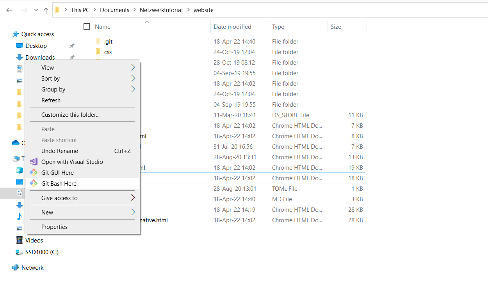

# Insterburg Webseite


## Description

Hier kannst du den Source-Code für die Insterburg-Webseite finden. **Alle Änderungen, die auf der Master-Branch gepusht werden, werden gleich in der insterburg.org Webseite erscheinen**. Deswegen solltest du aufpassen, wenn du den Befehl "git push" ausführst. Falls du nicht verstehst, was ich in dem vorherigen Satz gemeint habe, empfehle ich dir mehr über die Git-Branches zu lesen: 
* https://www.atlassian.com/git/tutorials/using-branches#:~:text=The%20git%20branch%20command%20lets,checkout%20and%20git%20merge%20commands.
* https://www.atlassian.com/git/tutorials/using-branches/git-checkout#:~:text=The%20git%20checkout%20command%20lets,new%20commits%20on%20that%20branch.
* Informatik-Mitbewohner nachfragen :D 

## Getting Started

Um anzufangen muss du folgendes machen:
 * Install GIT https://git-scm.com/book/en/v2/Getting-Started-Installing-Git
 * In einem Ordner, wo du das Projekt ablegen willst, rechtsklicken und "Git bash here" ausführen wählen.  
 * In dem geöffneten Terminal folgende Befehl ausführen:
 ```
git clone https://gitlab.com/insterburg/website.git
```
Es wird vermutlich erforderlich sein, dass du dich mit deinem Gitlab Account anmelden musst, um das Projekt herunterzuladen. Ausserdem kann es sein dass dir die Berechtigung von einem "Owner" des Projekts erteilt werden muss.

Falls der Projekt in eine Ordner schon heruntergeladen ist und du nur Änderungen durchzuführen willst, musst du zuerst folgende Befehl bei dir auf dem Laptop ausführen:
```
git pull
```
Damit wird den Projekt auf deinem Laptop aktualisiert. 
* Um das Projekt besser anzuschauen, solltest du einen Code Editor installieren. Ich empfehle dir den Visual Code: https://code.visualstudio.com/download . Darin kannst du die Ordner mit dem Webseite-Projekt öffnen und alle Dateien anschauen. 

Ich empfehle dir über die folgende GIT-Befehle zu lesen, bevor du anfängst die Änderungen durchzuführen:
* git status
* git add .
* git push
* git commit -m "Beschreibung von durchgeführten Änderungen"
* git branch
* git checkout
* git log
* git pull

Die offiziele Dokumentation kannst du auf der folgenden Webseite https://git-scm.com/book/de/v2 finden, aber es gibt auch viele anderen Webseiten, wo GIT gut erklärt wird. Zum Beispiel https://www.w3schools.com/git/ . 

### Projekt-Struktur

Die Implementierung von der Startseite kannst du in der Datei "index.html" finden. Falls du die Änderungen bei dir Lokal durchführst, kannst die "index.html" Datei öffnen, um zu schauen, wie die Änderungen aussehen können. Zuerst sind die Änderungen nur bei dir lokal und nicht auf der Webseiten.
Von der Startseite kannst du dich zu den anderen Seiten navigieren, die ensprechenden Namen haben. Zum Beispiel die Webseite über die Tutorials wird in der Datei "tutorials.html" implementiert. 

### Durchführung der Änderungen auf der offiziellen Insterburg.org Webseite 

1. Git-Bash öffnen  oder Terminal in Visual Studio Code.
2. ```git status``` in Terminal ausführen, um zu überprüfen, ob GIT richtig funktioniert. Falls es eine Fehlermeldung gibt, überprüfe, ob den Terminal sich in der Ordner "website" befindet. Mit dem Befehl "cd website" kannst du dich im Terminal aus dem Überordner in diesen Ordner navigieren. 
3. ```git pull``` ausführen, um das Projekt zu aktualisieren.  
4. Die Änderungen lokal durchführen
5. Überprüfen, ob alles stimmt, indem du die ".html"-Dateien auf deinem Laptop im Browser öffnest.
6. ```git status``` noch Mal in Terminal ausführen, um zu überprüfen, ob alles stimmt.
7. ```git add .```  ausführen, um deine Änderungen zu dem Commit hinzufügen. 
8. ```git commit -m "gute Beschereibung deiner Aenderungen"  ``` ein Commit erstellen. Es ist sehr wichtig klar zu beschreiben, was du geändert hast. Ansonsten wird den Projekt sehr chaotisch und es können viele Schwierigkeiten entstehen. 
9. ```git push``` Deine Änderungen auf Gitlab hochladen. **Die Änderungen werden auf der Webseite erscheinen, falls du auf der Master-Branch gearbeitet hast.** 
Falls die Befehl nicht funktioniert, es kann sein, dass du deine Gitlab-Credentials in Terminal angeben musst. Über diese Fehlermeldung kannst du hier lesen https://git-scm.com/book/en/v2/Customizing-Git-Git-Configuration .  


